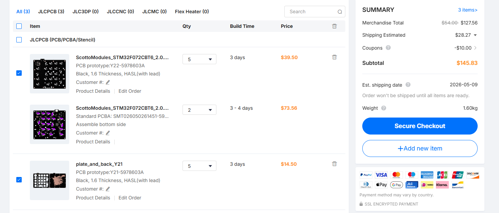
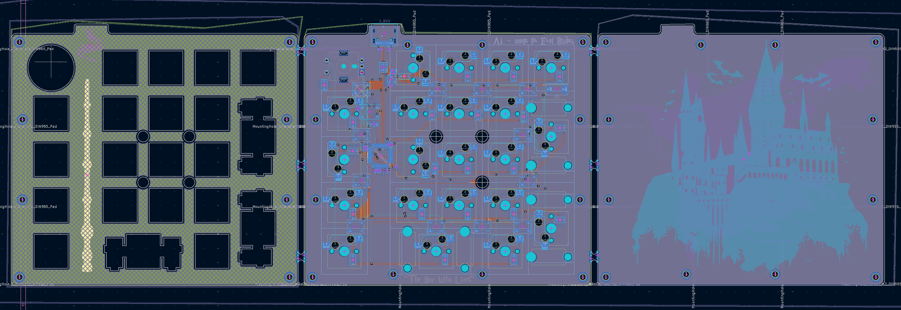

# random ass keyboard
this is my first entery into the stm32 world... im building a stm32 numpad +4keys + knob + under glow hot swap build. i will be using zmk and jlcPCBA service.

to use this you will need to program it via qmk, and solder the pcb yourself. you will also need hardware to assemble it.

BOM:

| quantity | name | value/lcsc |
|:--------:|:----:|:------|
| 21 | hot swap sockets | . |
| 1 | ec11 | . |
| 1 | push button | TL3342 |
| 1 | esd | USBLC6-2SC6 |
| 1 | fuse | Fuse_0603 |
| 5 | capacitor 0402 | 100nF |
| 3 | capacitor 0402 | 1uF |
| 2 | capacitor 0402 | 4.7uF |
| 1 | polarized capacitor | 100uF, 10v |
| 2 | resistor 0402 | 5.1k |
| 1 | resistor 0402 | 10k |
| 1 | resistor 0805 | 330R |
| 22 | diode sod | 123 |
| 12 | led | ws2812b |
| 1 | stm32 | stm32f072cbt6 |
| 1 | voltage regulator | XC6206 |
| 1 | usb c | USB_C_HRO_TYPE-C-31-M-12 |  
---
  
this should cost about 150$
  
this is the board.
you should have the pcb seperated from the plate and back.
you should assemble them with m2 screws and then put the switches in.
  
qmk firmware will be coming shortly